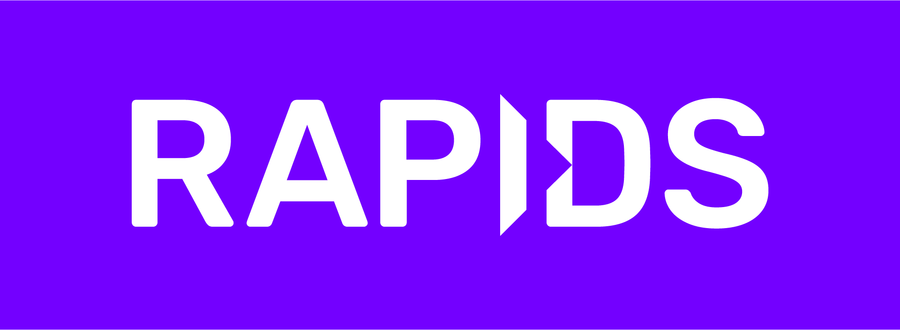

### Hi there 👋

<!--
**gregwchase/gregwchase** is a ✨ _special_ ✨ repository because its `README.md` (this file) appears on your GitHub profile.

Here are some ideas to get you started:

- 🔭 I’m currently working on ...
- 🌱 I’m currently learning ...
- 👯 I’m looking to collaborate on ...
- 🤔 I’m looking for help with ...
- 💬 Ask me about ...
- 📫 How to reach me: ...
- 😄 Pronouns: ...
- ⚡ Fun fact: ...
-->

## Technology Stack

This my current technology stack, which is what I use in my professional and personal development

Formatting credit to natkins

|Logo|Package|Use Cases|Notes|
|:-----|:-----|:-----|:-----|
|AWS|AWS|c|d|
|Dask|Dask|c|d|
|FastAPI|FastAPI|c|d|
|Poetry|Poetry|c|d|
||[RAPIDS](https://rapids.ai/index.html)|c|d|

